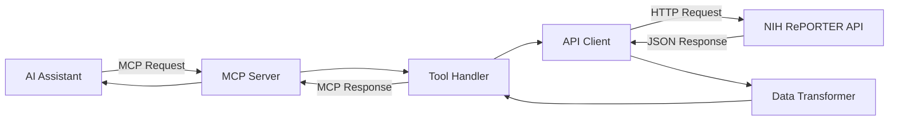

# NIH RePORTER MCP Server

A Model Context Protocol (MCP) server that provides seamless access to the NIH RePORTER APIs for exploring scientific award data from the National Institutes of Health (NIH) and non-NIH federal agencies.

## Overview

The NIH RePORTER MCP Server enables AI assistants to search, retrieve, and analyze federal research grant information through the official NIH RePORTER API (https://api.reporter.nih.gov/). This server implements the Model Context Protocol to provide structured access to comprehensive research funding data, including:

- Research project grants and contracts
- Principal investigator information
- Institution details
- Funding amounts and fiscal years
- Research abstracts and public health relevance statements
- Publication and patent outputs
- Clinical trial associations

## Repository Structure

```
nih-reporter-mcp/
├── src/                        # Source code
│   ├── server.js              # Main MCP server implementation
│   ├── api/                   # API integration modules
│   │   ├── client.js          # NIH RePORTER API client
│   │   ├── endpoints.js       # API endpoint definitions
│   │   └── transformers.js    # Data transformation utilities
│   ├── tools/                 # MCP tool implementations
│   │   ├── search-awards.js   # Award search functionality
│   │   ├── get-project.js     # Single project retrieval
│   │   ├── search-pis.js      # Principal investigator search
│   │   └── get-publications.js # Publication data retrieval
│   ├── schemas/               # JSON schemas for tools
│   │   └── tool-schemas.js    # Tool parameter definitions
│   └── utils/                 # Utility functions
│       ├── cache.js           # Response caching
│       ├── validators.js      # Input validation
│       └── error-handler.js   # Error handling
├── tests/                     # Test suites
│   ├── unit/                  # Unit tests
│   └── integration/           # Integration tests
├── docs/                      # Documentation
│   ├── api-reference.md       # NIH API documentation
│   ├── tool-usage.md          # Tool usage examples
│   └── development.md         # Development guide
├── examples/                  # Usage examples
│   └── queries/               # Sample API queries
├── .env.example              # Environment variables template
├── package.json              # Node.js dependencies
├── mcp.json                  # MCP server manifest
├── LICENSE                   # MIT License
└── README.md                 # This file
```

## Architecture Design

### Core Components

#### 1. **MCP Server Core** (`src/server.js`)
- Implements the Model Context Protocol specification
- Handles tool registration and execution
- Manages client connections and sessions
- Provides error handling and logging

#### 2. **API Integration Layer** (`src/api/`)
- **client.js**: HTTP client for NIH RePORTER API communication
  - Implements retry logic and rate limiting
  - Handles authentication if required
  - Manages request/response formatting

- **endpoints.js**: API endpoint configurations
  - Projects endpoint: `/v2/projects/search`
  - Publications endpoint: `/v2/publications/search`
  - Organizations endpoint: `/v2/organizations/search`

- **transformers.js**: Data transformation utilities
  - Converts API responses to MCP-friendly formats
  - Handles nested data structures
  - Normalizes field names and types

#### 3. **MCP Tools** (`src/tools/`)
Implements specific search and retrieval capabilities:

- **search-awards**: Search for research awards
  - Parameters: keywords, PI name, institution, date range, funding amount
  - Returns: List of matching awards with summaries

- **get-project**: Retrieve detailed project information
  - Parameters: project ID or application ID
  - Returns: Complete project details including abstracts, funding, personnel

- **search-pis**: Search for principal investigators
  - Parameters: name, institution, research area
  - Returns: PI profiles with grant history

- **get-publications**: Retrieve publication data
  - Parameters: project ID, PI name, date range
  - Returns: Associated publications and citations

### Data Flow



### Key Features

#### Search Capabilities
- Full-text search across project titles and abstracts
- Advanced filtering by:
  - Funding agency (NIH institutes, NSF, CDC, etc.)
  - Award type (R01, R21, P01, etc.)
  - Fiscal year and date ranges
  - Geographic location
  - Congressional district
  - Study section

#### Data Retrieval
- Comprehensive project details
- Publication outputs linked to awards
- Clinical trial associations
- Patent information
- Similar project recommendations

#### Performance Optimization
- Response caching for frequently accessed data
- Pagination support for large result sets
- Concurrent request handling
- Connection pooling

## Installation

```bash
# Clone the repository
git clone https://github.com/yourusername/nih-reporter-mcp.git
cd nih-reporter-mcp

# Install dependencies
npm install

# Configure environment variables
cp .env.example .env
# Edit .env with your configuration

# Start the server
npm start
```

## Configuration

The server can be configured through environment variables:

```env
# Server Configuration
MCP_PORT=3000
MCP_HOST=localhost

# API Configuration
NIH_API_BASE_URL=https://api.reporter.nih.gov
NIH_API_TIMEOUT=30000
NIH_API_RATE_LIMIT=100

# Caching
CACHE_ENABLED=true
CACHE_TTL=3600
```

## Usage with Claude Desktop

Add the server to your Claude Desktop configuration:

```json
{
  "mcpServers": {
    "nih-reporter": {
      "command": "node",
      "args": ["/path/to/nih-reporter-mcp/src/server.js"],
      "env": {
        "NODE_ENV": "production"
      }
    }
  }
}
```

## Example Queries

### Search for COVID-19 Research Awards
```javascript
{
  "tool": "search-awards",
  "parameters": {
    "keywords": "COVID-19 SARS-CoV-2",
    "fiscal_year": [2020, 2021, 2022, 2023],
    "limit": 50
  }
}
```

### Find Awards by Principal Investigator
```javascript
{
  "tool": "search-awards",
  "parameters": {
    "pi_name": "John Smith",
    "institution": "Harvard",
    "include_subprojects": true
  }
}
```

### Get Project Details
```javascript
{
  "tool": "get-project",
  "parameters": {
    "project_id": "5R01AI123456-03"
  }
}
```

## Development

### Running Tests
```bash
# Run all tests
npm test

# Run unit tests
npm run test:unit

# Run integration tests
npm run test:integration

# Run with coverage
npm run test:coverage
```

### Building the Server
```bash
# Development build with watch mode
npm run dev

# Production build
npm run build
```

## API Reference

The server interfaces with the NIH RePORTER API v2. Key endpoints include:

- **Projects Search**: `POST /v2/projects/search`
- **Publications Search**: `POST /v2/publications/search`
- **Organizations**: `GET /v2/organizations`

For detailed API documentation, visit: https://api.reporter.nih.gov/

## Contributing

Contributions are welcome! Please read our contributing guidelines and submit pull requests to the main repository.

### Development Workflow
1. Fork the repository
2. Create a feature branch
3. Implement your changes with tests
4. Run the test suite
5. Submit a pull request

## License

This project is licensed under the MIT License - see the [LICENSE](LICENSE) file for details.

## Acknowledgments

- NIH RePORTER API for providing comprehensive research funding data
- Anthropic MCP team for the Model Context Protocol specification
- Open source contributors

## Support

For issues, questions, or suggestions, please open an issue on GitHub or contact the maintainers.
